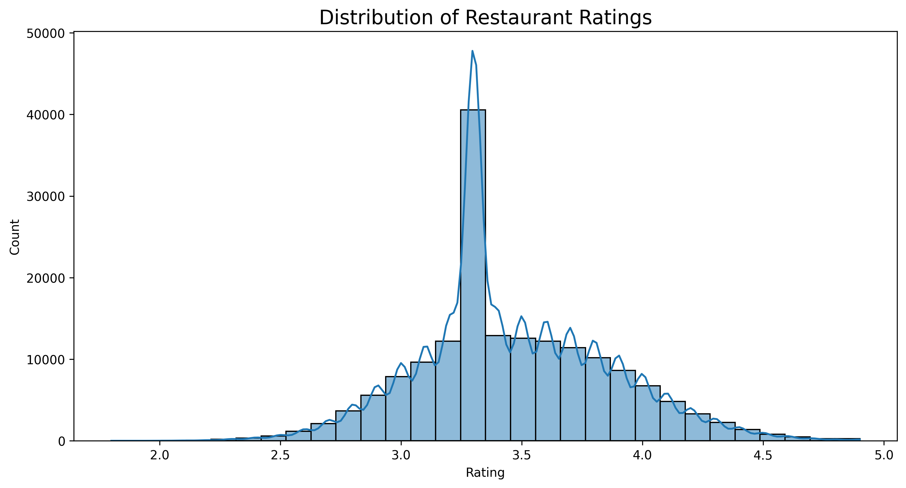
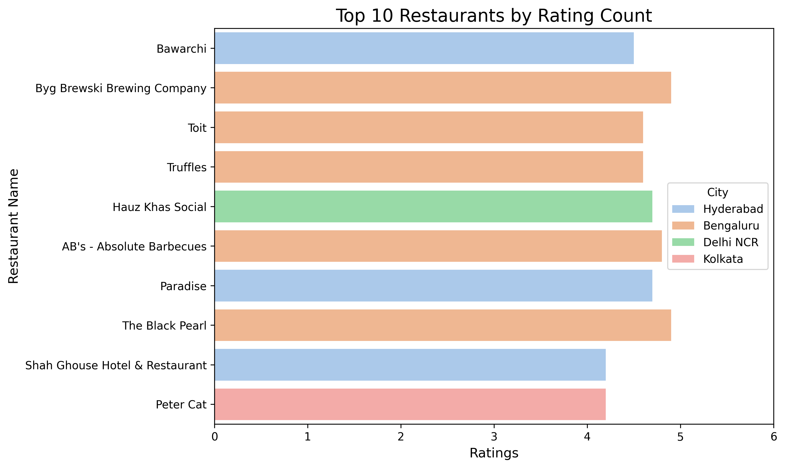
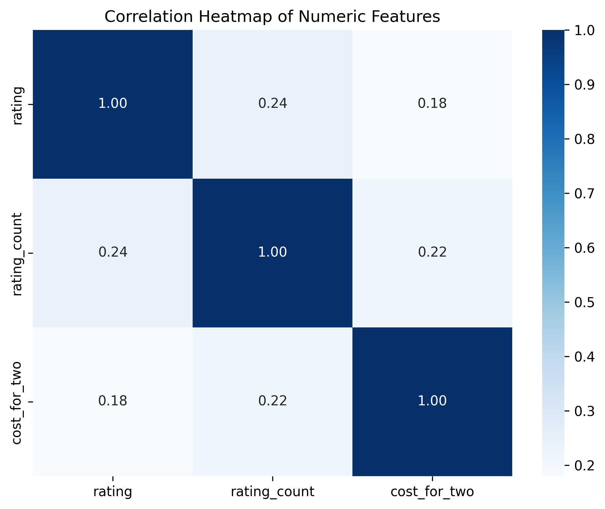

# 🍴 Zomato India Restaurant Data Analysis

## 📌 Overview  
This project is an **Exploratory Data Analysis (EDA)** of the Zomato India Restaurants dataset (200k+ records).  
The goal is to uncover insights about **restaurant distribution, cost trends, cuisine popularity, ratings, and service types**.  

The analysis provides:  
- 📊 Data cleaning & preprocessing workflow  
- 🔎 Exploration of numeric & categorical features  
- 🌍 Business insights into restaurant industry patterns  
- 📈 Visualizations to support findings  

---

## 📂 Project Structure  

- `data/` → Dataset files (sample/raw)  
- `notebooks/` → Jupyter notebooks for exploration  
- `plots/` → Saved visualization PNGs  
- `zomato-eda.ipynb` → Main analysis notebook  
- `requirements.txt` → Dependencies  
- `LICENSE` → MIT License  
- `README.md` → Project documentation  

---

## ⚙️ Installation  

Clone the repo and install dependencies:

```bash
git clone https://github.com/princerg/zomato-eda-restaurant-analysis.git
cd zomato-eda-restaurant-analysis
pip install -r requirements.txt

```

## 📊 Key Analyses & Plots

🔹 Distribution & Trends

Ratings Distribution


🔹 Cuisines & Restaurant Types

Top 10 Cuisines



🔹 Relationship Insights

Correlation Heatmap



## 💡 Insights

Some of the key findings include:
- Most restaurants fall within a cost range of ₹200–₹600 for two.
- Ratings are generally skewed towards the 3.2–3.6 range, with very few extremes.
- North Indian & Chinese cuisines dominate in popularity.
- Higher-rated restaurants often charge slightly higher costs for two, but affordability does not always mean lower ratings.

## 🚀 Future Work

- 🌍 Add geo-spatial analysis (city/area distribution)
- 📊 Build predictive models (e.g., predict rating from cost, cuisine, and services)
- 🖥️ Deploy insights on an interactive dashboard (Streamlit/PowerBI)

## 📜 License
- This project is licensed under the MIT License — free to use and modify.
